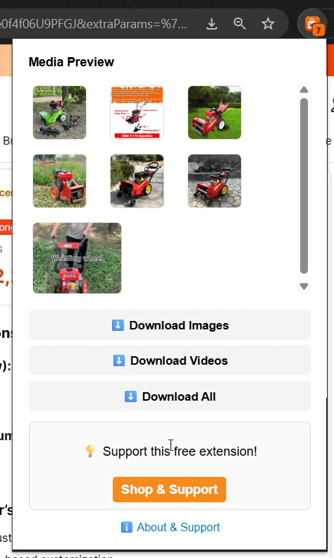
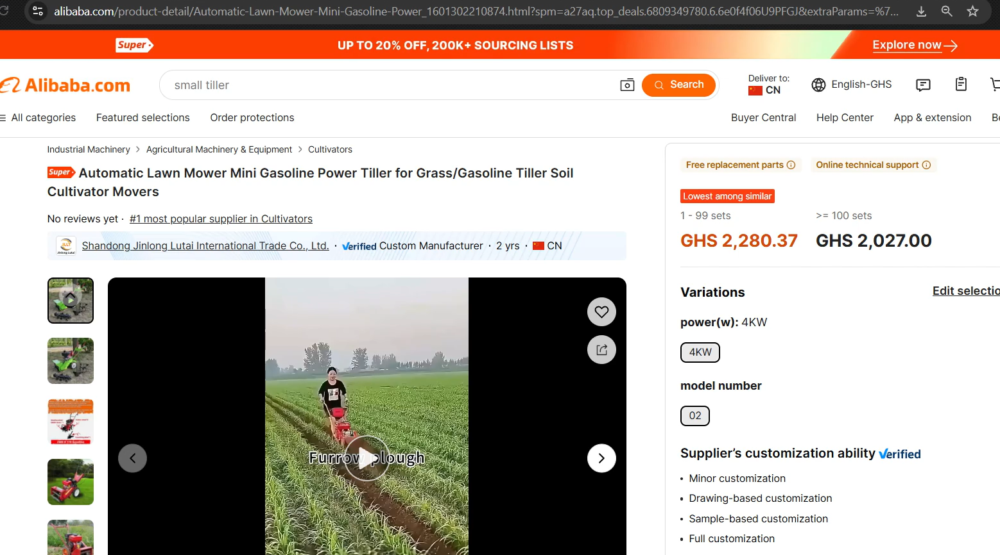
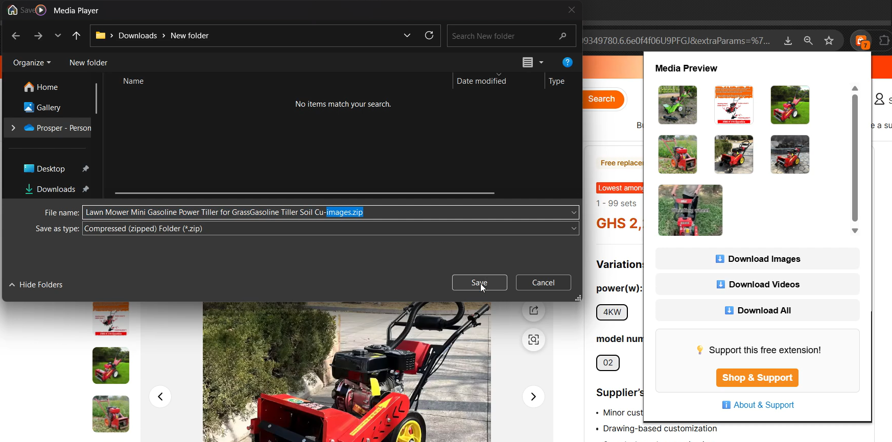
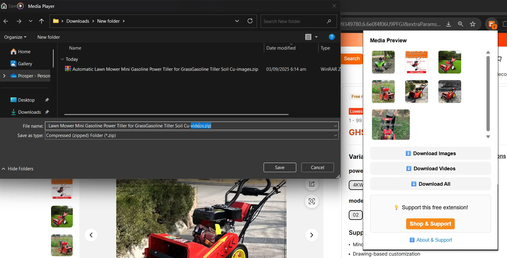

# Alibaba Downloader Pro  

🚀 **Alibaba Downloader Pro** is a free Chrome Extension that lets you **easily download images and videos** from Alibaba product pages — all in one click. Save product media into neatly organized **ZIP files** for faster workflow, research, or offline use.  

👉 [Install from Chrome Web Store](https://chromewebstore.google.com/detail/alibaba-media-downloader/opbecmocliofeeooopdodcneelbconmp?authuser=0&hl=en-GB) 

---

## ✨ Features
- 🖼 **Download product images** in full resolution.  
- 🎥 **Download videos** directly from product listings.  
- 📦 **One-click ZIP export** – save all media at once.  
- 🔎 **Clean, simple preview** inside the extension popup.  
- 💡 Works seamlessly on most **Alibaba product pages**.  

---

## 📸 Screenshots

### 🔹 Popup Overview
* **Main Popup UI** when a user clicks the add-on icon.
  

---

### 🔹 Product Media Previews
* Example showing product images and videos detected on an Alibaba product page.

---

### 🔹 Download Options
* **Save All (Images + Videos)**  

* **Save Images Only**  

* **Save Videos Only**  

---

## 🎬 Video Demo

### 📺 Walkthrough: Downloading Alibaba Videos & Images
A brief video showcasing the add-on's features and how it works.

---

## 📥 How It Works
1. Open an Alibaba product page.  
2. Click the **Alibaba Downloader Pro** icon in Chrome.  
3. Preview all available images and videos.  
4. Choose: **Download Images**, **Download Videos**, or **Download All**.  
5. Files are saved instantly as a ZIP with the product title in the name.  

---

## 🔗 Support the Developer
This project is free to use. To support development, we may show an **ad link** after download.  
Clicking it helps keep the extension free ❤️  

---

## 📄 About
Alibaba Downloader Pro was created to simplify the process of collecting product media for:  
- 🛒 Dropshippers  
- 📊 Market researchers  
- 📁 Collectors & archivists  

---

## ⚡ Installation
**[Chrome Web Store](https://chromewebstore.google.com/detail/alibaba-media-downloader/opbecmocliofeeooopdodcneelbconmp?authuser=0&hl=en-GB)**.  

For manual installation (dev mode):  
1. Clone this repo.  
2. Build using `npm run build`.  
3. Load the `dist/` folder into Chrome (Extensions > Developer Mode > Load Unpacked).  

---

## 📝 License
MIT License – free to use and modify.  

---

## 📢 Keywords (SEO)
Alibaba downloader, Alibaba image downloader, Alibaba video downloader, Alibaba ZIP export, Chrome extension for Alibaba, download Alibaba product media
